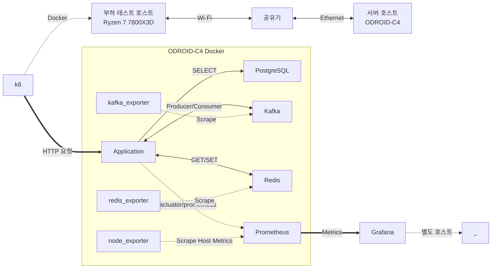

## 개요

단축 URL 도메인을 바탕으로 Java 및 Spring Boot 스택을 사용하는 프로젝트를 진행합니다.
트래픽이 몰리는 상황을 가정한 부하 테스트를 작성하고, 점진적으로 아키텍처를 개선해서 성능 및 안정성을 확보합니다.

## 테스트 환경

서버 프로세스와 DB 및 이벤트 브로커 등 인프라를 실행할 호스트와 부하 테스트를 실행할 호스트를 분리해서, 자원 경쟁으로 인한 성능 측정 지표의 왜곡을 방지합니다.

**부하 테스트 호스트**

| 구분      | 사양                                                   | 비고    |
|---------|------------------------------------------------------|-------|
| CPU     | AMD Ryzen 7 7800X3D, 8 cores / 16 threads, 최대 5.0GHz | k6 실행 |
| Memory  | DDR5 32GB                                            |       |
| Network |                                                      |       |
| Storage | SAMSUNG PM9A1 NVMe M.2 SSD 1TB x 2                   |       |
| OS      | Arch Linux (x86_64)                                  |       |
| 커널      | 7.0.11                                               |       |

**서버 호스트**

| 부품      | 부품 명                                              | 비고  |
| ------- | ------------------------------------------------- | --- |
| CPU     | AMD Ryzen 7 7600, 6 cores / 12 threads, 최대 5.1GHz |     |
| Memory  | DDR5 32GB                                         |     |
| Network |                                                   |     |
| Storage | ADATA LEGEND 960 NVMe M.2 SSD 2TB                 |     |
| OS      | Debian GNU/Linux 13 (trixie) (x64-64)             |     |
| 커널      | 6.12.69                                           |     |


**서버 호스트 도커 컴포즈 구성**

| 서비스                | CPU 제한 | 메모리 제한 | 비고                                                                                                                                                                  |
| ------------------ | ------ | ------ | ------------------------------------------------------------------------------------------------------------------------------------------------------------------- |
| gateway            | 2.0    | 512m   | 코어 개수에 비례해서 요청 처리 이벤트 루프 스레드를 할당하므로 할당된 코어가 적을 경우 높은 throughput에서 병목 지점이 될 수 있음                                                                                     |
| redirect           | 2.0    | 1g     | 주요 부하 테스트 측정 지점이 될 Redirect 처리 서비스. 요청 당 스레드를 할당하는 Tomcat 환경에서 높은 throughput을 유지해야할 경우, 하나의 코어에 많은 스레드 연산이 몰리면서 context switching 오버헤드가 발생할 것으로 예상하여 코어 자원을 추가로 할당함 |
| url                | 1.0    | 512m   | 단축 URL 생성                                                                                                                                                           |
| statistics         | 1.0    | 512m   | 클릭 통계 집계                                                                                                                                                            |
| PostgreSQL         | 2.0    | 2g     | PostgreSQL의 shared_buffer 내부 캐시 메모리를 확보해서 튜플 및 Index fetch 시 디스크 I/O 병목 방지                                                                                          |
| Kafka              | 1.0    | 1g     | 이벤트 브로커. 디스크 및 네트워크 I/O 연산이 주로 이뤄지며, JVM 구동 및 OS 페이지 캐시가 할당될 메모리가 필요함                                                                                               |
| Redis              | 1.0    | 1g     | Stage 3부터 도입                                                                                                                                                        |
| postgres_exporter  | 0.2    | 256m   |                                                                                                                                                                     |
| kafka_exporter     | 0.2    | 256m   | Consumer group 및 partition metric                                                                                                                                   |
| kafka_jmx_exporter | 0.2    | 256m   |                                                                                                                                                                     |
| redis_exporter     | 0.2    | 256m   | Redis metric                                                                                                                                                        |
| prometheus         | 0.2    | 256m   |                                                                                                                                                                     |

## 네트워크 토폴로지 구성



## 테스트

### 방법

### 측정 지표

###     

## 요구 사항 정의

### 단축 URL 생성

- **엔드포인트:** `POST /api/v1/urls`
- **HTTP 상태 코드:** `201 Created`

**Request Body:**
```json
{
  "originalUrl": "https://example.com/very/long/path",
  "ttlSeconds": 86400
}
```

| 필드 | 타입 | 설명 |
|------|------|------|
| `originalUrl` | string (URI) | 단축할 원본 URL |
| `ttlSeconds` | integer | 유효 기간 (초) |

**Response Body:**
```json
{
  "shortKey": "abc123",
  "shortUrl": "http://localhost:8081/abc123",
  "originalUrl": "https://example.com/very/long/path",
  "createdAt": "2025-07-15T10:30:00Z",
  "expiresAt": "2025-07-16T10:30:00Z"
}
```

| 필드 | 타입 | 설명 |
|------|------|------|
| `shortKey` | string | 인코딩된 짧은 키 (ByteCodec: Base256 → custom charset) |
| `shortUrl` | string (URI) | 단축 URL (`{baseUrl}/{shortKey}`) |
| `originalUrl` | string (URI) | 원본 URL |
| `createdAt` | string (datetime) | 생성 시각 (ISO 8601) |
| `expiresAt` | string (datetime) | 만료 시각 (ISO 8601) |

### 단축 URL 리다이렉트

- **엔드포인트:** `GET /api/v1/redirect/{shortKey}`
- **HTTP 상태 코드:** `307 Temporary Redirect`

**Path Variable:**

| 파라미터 | 타입 | 설명 |
|---------|------|------|
| `shortKey` | string | 단축 URL 키 |

**Request Headers:**

| 헤더 | 필수 | 설명 |
|------|------|------|
| `Referer` | 선택 | 방문 경로 (누락 시 `direct`로 처리) |
| `User-Agent` | 선택 | 디바이스 타입 판별 (DESKTOP/MOBILE/TABLET/BOT/UNKNOWN) |

**Response Headers:**

| 헤더 | 설명 |
|------|------|
| `Location` | 원본 URL (307 리다이렉트 대상) |

**비고:**
- 요청 본문 없음. 디바이스 타입 및 referrer는 HTTP 헤더에서 자동 파싱
- 유효하지 않은 shortKey인 경우 `404 Not Found` 반환
- 만료된 shortKey인 경우 `410 Gone` 반환

## 단축 URL 상세 정보 조회

### 단축 URL 통계 조회

## 전체 소스

- 공개 레포지토리 링크: https://github.com/lilamaris/shrturl

## 부하 테스트 시나리오

- 소스 링크: https://github.com/lilamaris/shrturl/

## 아키텍처 개선 단계

### 1. 멀티 모듈 + EDA

- 단축 URL 생성 시 UrlCreated 이벤트 발행
- 단축 URL 리다이렉트 시 UrlRedirected 이벤트 발행
- 통계 서버는 UrlRedirected 이벤트 소비해서 통계에 반영함

### 아키텍처 특징

- 모놀리스 구조 대신 멀티 모듈 구조로 시작함
- 모듈은 행위를 기준으로 분리함
- 도메인은 그 데이터를 제어하는 가장 가까운 모듈이 소유하는 구조를 채택함
- 데이터는 DB에만 저장되고, 조회 시 캐시는 사용하지 않음
- 모듈 간 통신에 이벤트 브로커가 개입하지만 Batch Consume이나 멀티 스레딩 등 어떠한 최적화 기법도 적용하지 않음
- 기준 커밋: 8f85b871

### 성능 측정 결과

baseline:

kafka consume lag 개선: RPS stage 1500부터 p99, p95 증가하기 시작
baseline에서 RPS 1500 부터 폭증하던 Consume lag은 해소됨 Produced/sec와 Consume/sec 균형이 맞아서 Consume Lag 최대 ~까지만 찍혔음
테스트 다시 돌려서 lag이 다시 회복하는데 걸리는 시간 (peek 트래픽 찍고 예상 normal 트래픽 rps 유지 시 회복하는데 걸리는 시간) 필요함


redirect key redis 캐시 적용: redirect p99, p95 개선(예상)